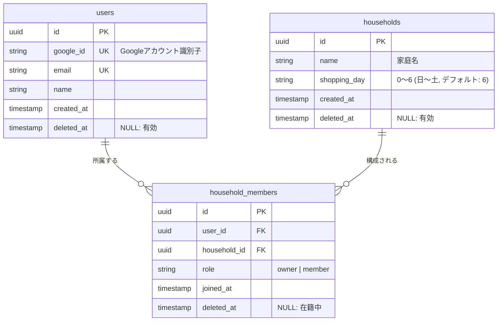
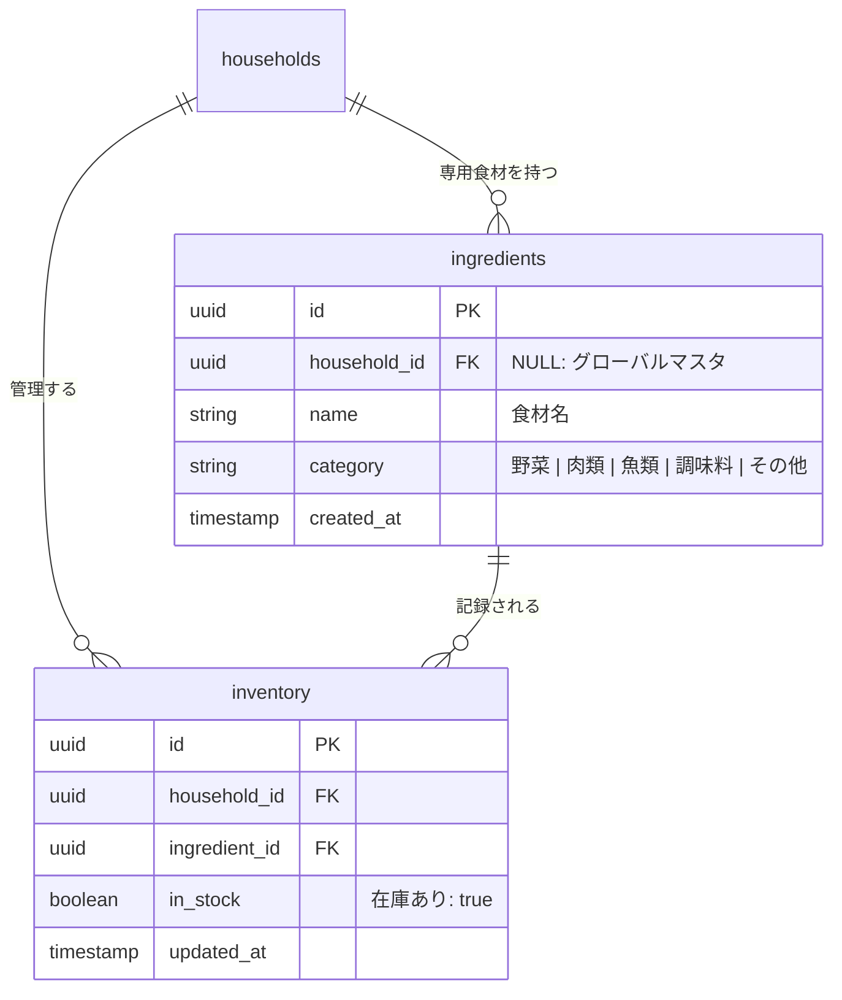
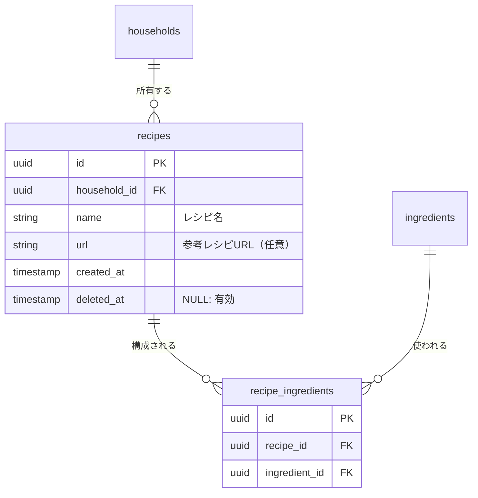
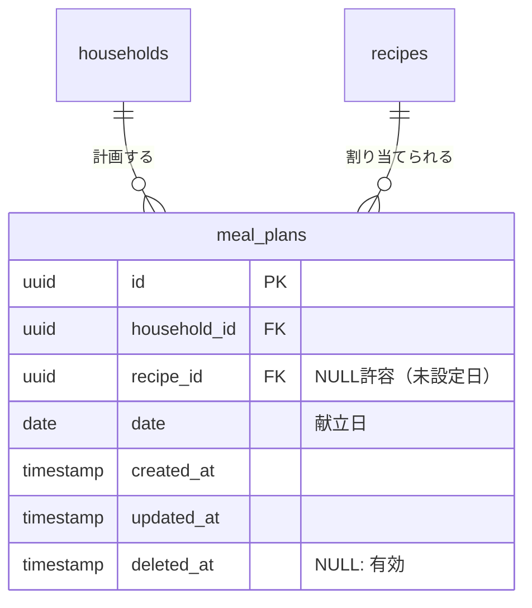
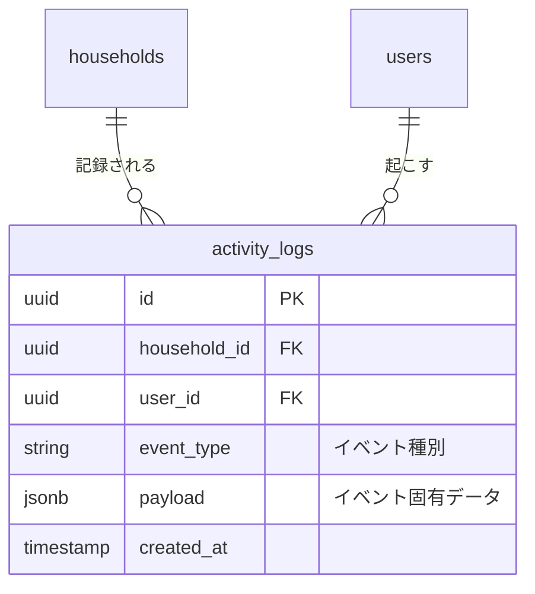

# DBスキーマ設計

## ユーザー関連テーブル



### 補足

**users**
- `google_id`: Google OAuth で取得する `sub` クレーム。ログイン時の照合に使用。
- `email`: Google アカウントのメールアドレス。

**households**
- 1ユーザーが複数の家庭に所属することを想定した設計（例: 実家と自分の家）。
- MVP では1ユーザー1家庭を前提として扱う。
- `shopping_day`: 買い物曜日を `0`（日）〜 `6`（土）の整数で管理する。デフォルトは `6`（土曜）。NULL非許容とすることでエッジケース処理を不要にする。

**household_members**
- `role`: `owner`（家庭を作成したユーザー）/ `member`（招待されたユーザー）。
- MVP では role による権限制御は実装しないが、将来の拡張のためカラムを持つ。

---

## 食材・在庫関連テーブル



### 補足

**ingredients**
- `household_id` が NULL のレコードはグローバルマスタ（全家庭共有）。MVP では固定のマスタデータをシードとして投入する。
- `household_id` に値を持つレコードは家庭専用食材。レシピ登録時にコピペした材料テキストから Claude API が抽出し、グローバルマスタと一致しなかった食材が該当家庭の `household_id` で新規追加される。
- MVP 以降、分量単位（例: g、個）を管理するカラムの追加を予定している。
- MVP 以降、カテゴリー分類の拡張（果物、お菓子など）を予定している。

**inventory**
- 家庭ごとの在庫状態を管理する。`ingredients` とは分離することで、同じ食材でも家庭によって在庫状況が異なる状態を表現できる。
- `in_stock` のデフォルトは `false`（在庫なし）。
- `(household_id, ingredient_id)` に UNIQUE 制約を付ける（1家庭につき1食材1レコード）。

---

## レシピ関連テーブル



### 補足

**recipes**
- 家庭ごとのレシピを管理する（`household_id` で紐づけ）。他の家庭のレシピは参照できない。
- `url` は任意項目。外部レシピサイトへのリンクを保存する。

**recipe_ingredients**
- レシピと食材の中間テーブル。
- `(recipe_id, ingredient_id)` に UNIQUE 制約を付ける（同じ食材の重複登録を防ぐ）。
- MVP 以降、分量単位カラムの追加を予定している（ingredients テーブルの分量単位対応と連動）。

---

## 献立関連テーブル



### 補足

**meal_plans**
- 家庭ごとの日付別献立を管理する。
- `recipe_id` は NULL 許容。献立未設定の日もレコードとして持つことができるが、MVP ではレシピが設定された日のみ INSERT する運用を想定。
- `(household_id, date)` に UNIQUE 制約を付ける（1家庭1日1献立）。

---

## ログ・分析関連テーブル



### 補足

**activity_logs**
- ユーザーの行動イベントを記録する。データ分析・消費傾向の把握を目的とする。
- `event_type` の例:
  - `ingredient_consumed`: 食材を使い切った
  - `recipe_cooked`: 献立を完了した
  - `inventory_updated`: 在庫状態を変更した
- `payload` は JSONB 型。イベントごとの追加データ（どの食材か、どのレシピかなど）を柔軟に格納する。
- MVP では記録のみ行い、分析 UI の実装は MVP 以降とする。

### データ分析の将来構成

データ量が増えた段階では、OLTP と OLAP を分離する構成を想定する。

```
Supabase (OLTP) → ETL / Logical Replication → BigQuery (OLAP)
```

Supabase は PostgreSQL の論理レプリケーションおよび Webhook 経由での BigQuery 連携が可能なため、将来のデータ基盤への移行パスが確保されている。

### ソフトデリートの方針

分析時に削除済みデータを参照できるよう、以下のテーブルに `deleted_at` カラムを持つ。`NULL` の場合は有効なレコード、値がある場合は削除済みとして扱う。

| テーブル | 追加 | 目的 |
|----------|------|------|
| `users` | ✅ | アカウント削除後も `activity_logs` との紐づけを保持 |
| `households` | ✅ | 家庭解散後の履歴追跡 |
| `household_members` | ✅ | 脱退メンバーの行動履歴を保持 |
| `recipes` | ✅ | 削除済みレシピの調理回数などを分析 |
| `meal_plans` | ✅ | 削除された献立の履歴を分析 |
| `ingredients` | ❌ | グローバルマスタは削除しない。家庭専用食材（`household_id` あり）も参照整合性を `recipe_ingredients` で保つためハードデリートは不可とし、削除は行わない運用を想定 |
| `inventory` | ❌ | 在庫状態の管理テーブルであり履歴不要 |
| `recipe_ingredients` | ❌ | `recipes` の削除に追従するため個別管理不要 |
| `activity_logs` | ❌ | ログは削除しない |

アプリ側では通常クエリに `WHERE deleted_at IS NULL` を付与し、削除済みレコードを除外して扱う。
